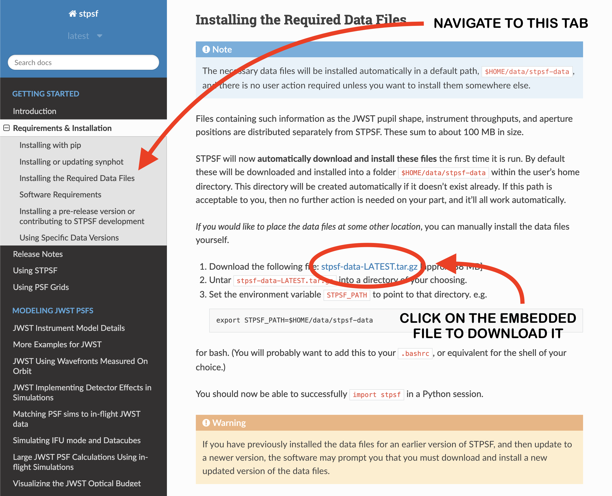
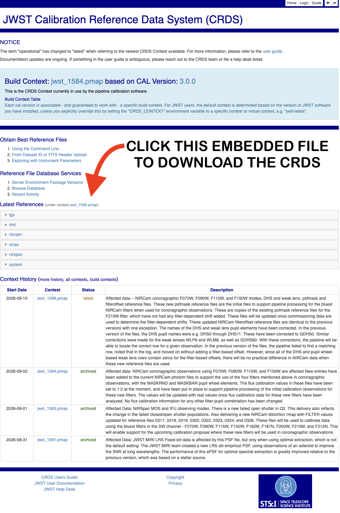

# Create a home for spaceKLIP
First, create a new environment to run spaceKLIP in, so that you may control the specific versions of its dependencies.

    conda deactivate
    conda create -n spaceklip python=3.11
    conda activate spaceklip

The next steps will retrieve all of the files spaceKLIP needs to run, including the requirements.txt file to install dependencies and spaceKLIP functions. If you have a specific directory you would like to install the package in, navigate to that path with

### OPTION A

    cd /desired/directory/

Otherwise create a new directory to store spaceKLIP in with

### OPTION B

    cd ~
    mkdir packages
    cd packages 

# Retrieve and install the package
You will now retrieve the spaceKLIP files from Space Telescope Science Institute’s GitHub page. Install the package and its dependencies.

    git clone https://github.com/spacetelescope/spaceKLIP.git
    cd spaceKLIP
    pip install requirements.txt
    pip install -e .

Install some extra tools that will improve your experience with the package.

    conda install jupyter
    pip install ipywidgets
    pip install jwst_mast_query

# Configuring STPSF & webbpsf_ext
Though your machine can now find the functions defined by spaceKLIP, two of its dependencies (STPSF and webbpsf_ext) require additional configuration to create models of the telescope's point-spread functions (PSFs). 

## Make PSF masks

First run the provided script to create a model of the throughput for different combinations of coronagraphic masks and filters.

    cd spaceKLIP
    python make_psfmasks.py

## Download STPSF data

Next you will need to download a ~100 MB package containing the latest measurements of JWST performance, and untar it into a directory of your choosing. If you do not have a directory already intended fo these files, you may create one with

    cd ~/packages/spaceKLIP
    mkdir spaceklip_repos
    cd spaceklip_repos

Use this link to the page hosting the download: [https://stpsf.readthedocs.io/en/latest/installation.html](https://stpsf.readthedocs.io/en/latest/installation.html). Use the tab on the left of the page to navigate to the "Requirements & Installation" section, and then the "Installing the Required Data" subsection; download the file named "stpsf-data-LATEST.tar.gz". The page will be laid out as in the screenshot below.

## Download CRDS files

Then you will need to download a ~1 GB package from the JWST Calibration Reference Data System (CRDS)

Use this link to navigate to the page hosting the latest reference files: [https://jwst-crds.stsci.edu/](https://jwst-crds.stsci.edu/). The page will be laid out as in the screenshot below; download the file under "Latest References."

Move both files into your spaceklip_repos folder and click on them to unpack them.

## Edit your bash profile
STPSF and webbpsf_ext need to access the reference files you have just downloaded, so you need to set the environment vairables they call in your bash profile.

Open your bash profile with

    open ~/.bash_profile

Copy the following environment variables into your bash profile:

    export STPSF_PATH='$HOME/packages/spaceKLIP/spaceklip_repos/stpsf-data/'
    export WEBBPSF_EXT_PATH='$HOME/packages/spaceKLIP/spaceklip_repos/webbpsf_ext_data/'
    export PYSYN_CDBS='$HOME/packages/spaceKLIP/spaceklip_repos/trds/'
    export CRDS_PATH='$HOME/spaceKLIP/spaceklip_repos/crds_cache/'
    export CRDS_SERVER_URL='https://jwst-crds.stsci.edu'

Finally save your changes with

    source ~/.bash_profile

You are now ready to run spaceKLIP in its entirety!

